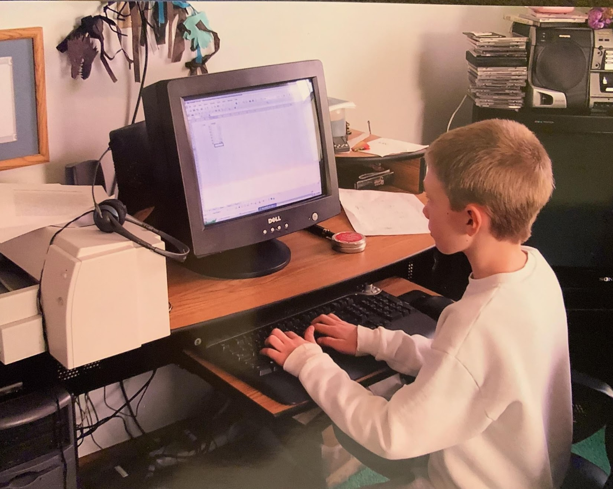
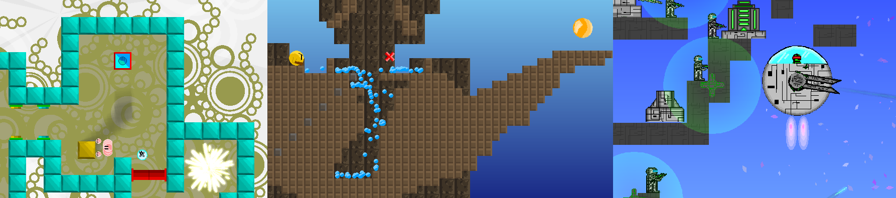
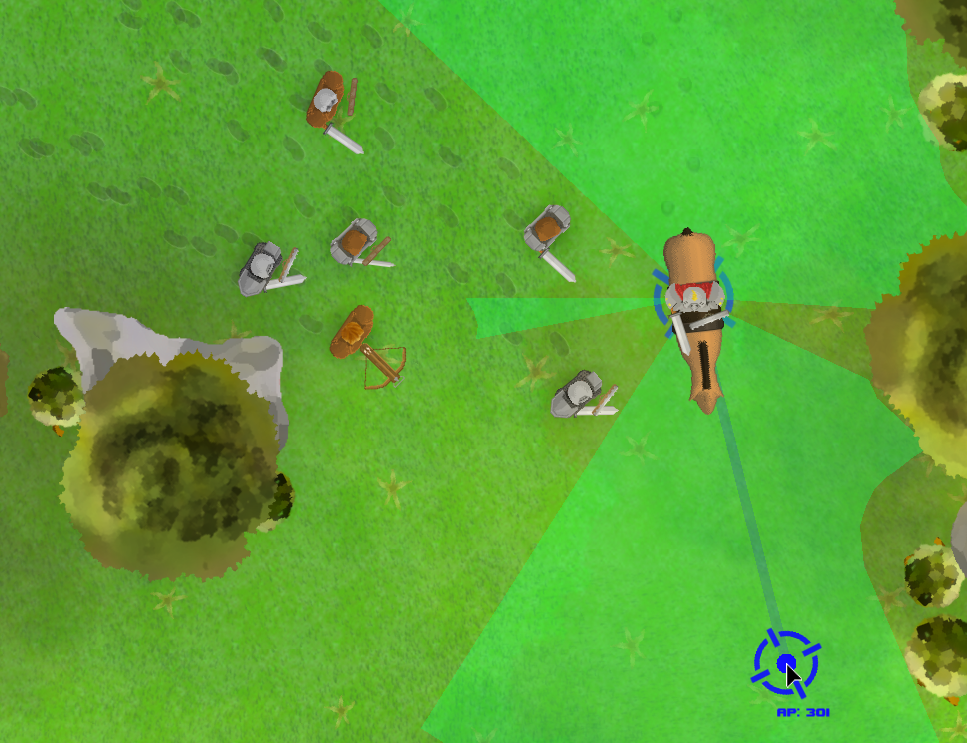
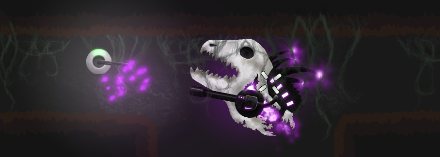
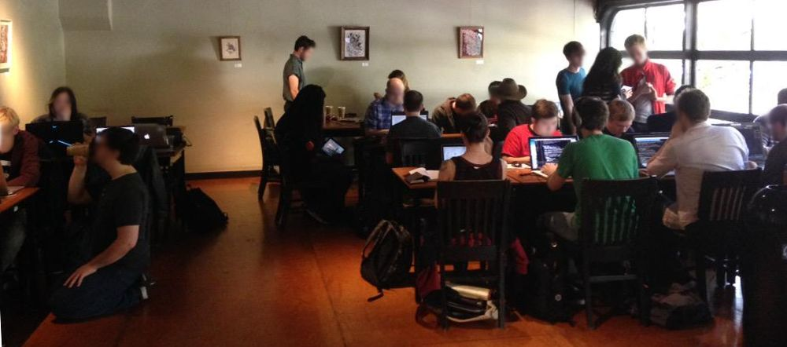
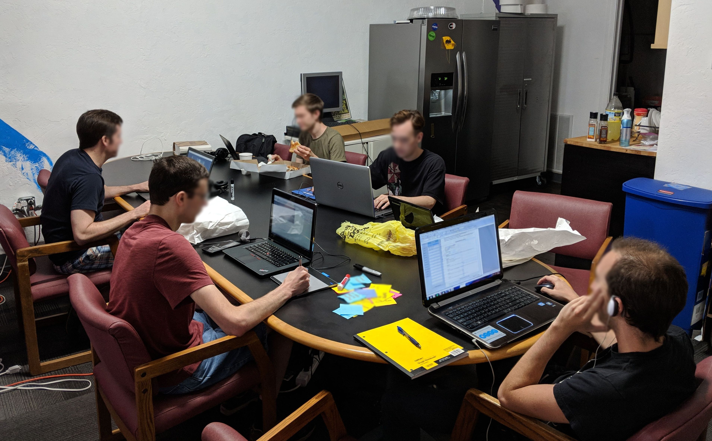

This post started by me trying to write my [about]({{ '/about/' | url }}) page, but I got carried away and wrote way too much. Therefore, I'm dumping it here as a dedicated post.

## 1. Early childhood: pen-and-paper

I have loved games for as long as I can remember, and by that I mean both playing games and making them. I loved to draw as well, so much of my earliest games were pen-and-paper. Some were designed as reusable board games, but this was less common.

My favorite was a pen-and-paper role-playing game that sort of started by me just drawing medieval warriors running around and fighting. Over time I added rules to how the drawing would progress, but those rules were loose because playing the game itself was a creative expression. If I were introduced to Dungeons & Dragons during these years, I would have loved it. However, I didn't actually learn about Dungeons & Dragons until my late teenage years, and by then I had long since been playing my own sort of version that had evolved from this pen-and-paper game.

<!-- TODO: Find some of your old stupid board games and put a picture here -->

My first introduction to digital creation media was [The Print Shop](https://en.wikipedia.org/wiki/The_Print_Shop) on our computer (I don't remember the version of The Print Shop, but I think we were using Windows 98 at the time). With this, I made little local websites (as groups of HTML pages) where you would navigate around by clicking images I had placed, which would take you to a new page. Somehow I was very entertained and made many 'games' that were effectively mazes you would navigate by clicking images to denote your choices.

<!-- Note: CSS rules will ignore you overriding the height. Overriding width instead just so the image doesn't take up too much space. -->

Later, I dabbled a little bit with some products from [The Game Creators](https://en.wikipedia.org/wiki/The_Game_Creators). I remember trying and failing to wrap my little brain around DarkBasic, but I had fun with FPS Creator. I hung around on the forums and tried to absorb knowledge from the other, more experienced game developers there. Mostly, this time was just spent being an annoying kid.

### Side Note: Other childhood inspirations

- [Final Fantasy Tactics](https://en.wikipedia.org/wiki/Final_Fantasy_Tactics): My favorite game of my childhood and responsible for me falling in love with the turn-based genre. The combat system of this game was the primary direction I ended up choosing to head when I later tried to adapt my pen-and-paper RPG into digital form.
  
- [Mage Knight](https://en.wikipedia.org/wiki/Mage_Knight) (_NOT_ the board game!): This was a miniatures game that I got into in elementary school. Building custom armies and situations gave me countless hours of entertainment. I still think the early editions of this game were really well designed. Unfortunately, I think the gameplay and unit design went downhill later in the life of the series before it ultimately died and had its IP revived in the form of a board game that plays nothing like the original.

- [Dynasty Warriors](https://en.wikipedia.org/wiki/Dynasty_Warriors): This is blending into the teenage years, but I think I started with a demo-disk of Dynasty Warriors 3 on the PlayStation 2, and then later bought Dynasty Warriors 4, which I played a lot of over the following years.

## 2. Teenage years - learning to code

Around the same time I was trying to build a shooter with FPSC, I also tried [GameMaker 6](https://en.wikipedia.org/wiki/GameMaker) and had started a few small projects with it using the graphical drag-and-drop programming. I wasn't particularly convinced that I could make something advanced in it until I had played some games by [Darthlupi](https://archive.org/details/The_Cleaner). This guy was a real inspiration for me, both in terms of what was possible with the tool but also in that I credit him as my starting point for learning to code.

Darthlupi had posted an open-source tutorial or example game on a web forum for GameMaker users that used GML (GameMaker Language). GML was a pseudo-JavaScript language used by GameMaker instead of the graphical drag-and-drop programming I had been using up until that point. Starting from this example, I taught myself programming at age 13 by digging through the (generally quite good!) documentation of GameMaker.

I had printed hundreds of pages of documentation out using my parents' printer (sorry!) that I downloaded over our dial-up internet, which I would consult when I got stuck and couldn't access the internet outside of times it was available. I spent the next couple of years building games with this, 3 of which I completed and maybe 6-10 at various stages of production that I abandoned.

Two of the games I made were for these multi-month competitions hosted by [YoYo Games](https://en.wikipedia.org/wiki/YoYo_Games) (who had acquired GameMaker a year or two after I had started using it). I didn't win anything (my games were bad), but they were a valuable learning experience, especially learning how to finish games and how to scope your games properly. If it weren't for the competition deadline, those projects would have ended up abandoned too. Finishing games is something a lot of game developers really struggle with, so I am happy that I got those repetitions in by making a few small, finished games.

## 3. My first 'big' game

After the freeware games, at 16 I was over-confident in my coding abilities and believed I could build anything I imagined. I felt that I was ready to build a 'big' game, which would be a digital version of my pen-and-paper role-playing game from my earlier childhood. This I will refer to as ✨The Dream Game✨ (It will come up again). I was still using GameMaker at this point, but the past several games of mine including this one were 100% using code (GML). 

This game was effectively going to have a strategic world map layer like [Mount & Blade](https://en.wikipedia.org/wiki/Mount_%26_Blade_(series)) (a game I was really enjoying at the time), but with tactical battles like Final Fantasy Tactics, and with a bunch of world-simulation fanciness sprinkled in as well. This was way over-scoped relative to my current skill level and what I had completed in the past. About 1 year into the project, I realized I was in over my head and that I needed to build up my skills more to be able to properly take on something this complex.

I started a new, unrelated project instead with a smaller scope. I was freshly inspired by the 2009 hit [Borderlands](https://en.wikipedia.org/wiki/Borderlands_(video_game)). The main inspiration from that game was the idea for procedurally-generated guns - I combined this with the idea of procedurally-generated caves from [Spelunky](https://en.wikipedia.org/wiki/Spelunky), another favorite of mine, to make a shooter-roguelike.

This project started at the age of 17 and finished at the age of 18 (I think ~1.5 years of work total), and [Koya Rift](https://store.steampowered.com/app/328990/Koya_Rift/) was the result! I sold it through my website for a few years, until I eventually got on Steam through their "Greenlight" program. This game isn't very good - I am still proud of what I accomplished though, because I stayed on schedule and released a bigger game. It was a valuable learning experience.

The deadline for Koya Rift was real, in that I had plans to study Computer Science at a university after I was finished with high school. I wanted to get the game finished and released so I didn't have to juggle that plus my university schoolwork because I was worried if that happened the game would never get done.

If I were doing this game over again, and had more time, I would have let it sit 'in the oven' for another year or so with a public demo, gathering feedback and making tweaks. I think in the end the content was a little too shallow and there were various usability issues that hampered it. Oh well!

## 4. University

Despite how it may seem, I never seriously considered studying game design or game programming, or otherwise trying to get a job in the games industry. Games were a passion of mine, and I didn't want to turn them into a job. I had also done research about the career prospects and projected salary for working in games, vs. just getting a regular software/programming job. This made it more clear to me that I should study computer science and have a normal software engineering career, which is what I chose to pursue. The closest candidate for a second choice was actually graphic design, since I loved art and working on computers. Career prospect research killed that idea.

So, I went to university to study Computer Science shortly after shipping Koya Rift. My gamedev journey continued - the first year or so there was spent working on and eventually releasing an update for the game. The entire time, I kept the ✨Dream Game✨ in the back of my mind. Now that I had gained much valuable experience from shipping Koya Rift, I knew I could do a better job. I started over, still using GML, even though I was becoming reasonably competent in C++ through my job at the robotics lab and my coursework. At the time, the current owners of GameMaker were trying to rebrand it as a more serious development tool and appeared to be putting in lots of effort to improve it, so that provided a sense of confidence that the situation would improve regarding 'serious' things I wanted out of it, like testing and debugging tools. 

We will call this restart of the project the 'V2' of the ✨Dream Game✨. Conceptually it's the same game as before, with some changes. Gameplay-wise, the biggest change is that it's now grid-based instead of free-movement. I also tried to start my campaign world layer at the same time as my battle layer, so that I could build up the interface between the two over time. This was a mistake the first go-around, where I worked only on the battle system and so I made many architectural errors in not thinking about how that mode would interact with all the other systems. Speaking of architecture, another change this time around was that V2 is now more data-driven in that I wanted players to be able to create and share mods with each other to change the content of the game.

I met two friends during this time that wanted to help with the project. We all worked together on it for a year or so, and that was really fun. I remember telling myself I would never work alone on a project again because of how miserable it was compared to working with people (spoiler alert: that didn't happen!). We had good fun, but ultimately other priorities competed and the other two dropped off of the project. 

<!--TODO: Screenshot of dream game v2 !-->

## 5. Being a real adult

After my collaborators dropped off of V2 of the ✨Dream Game✨, I continued working on it for maybe 3 or 4 more years. In that time, I had graduated from my university and got my first real adult job as a software engineer in Seattle, WA. I was still working on the ✨Dream Game✨ on nights and weekends, though not quite as briskly as I was during my university years. 

During this time of my first real software engineering job, I was learning things at the fastest pace I ever had in my life. Quickly I became frustrated with my old code and old decisions, but even more so I became frustrated with the limitations of the tools and language I was using. At my day job at this point, I was writing backend Java. In particular, one thing I noticed was that in the real world, we used automated tests to make sure that the software worked the way we thought it did. As my ✨Dream Game✨ project continued to grow in complexity, and without any automated test framework available for GML, I slowly became more convinced over time that I was permanently handicapping the scope of the project by not having all the tools available that using a real programming language would have. My motivation waned.

The project spent a few years in limbo here, where I worked on it a tiny bit, but I mostly experimented with other programming languages and tools. I tried out [Unreal Engine 4](https://en.wikipedia.org/wiki/Unreal_Engine_4), which was the new hotness at the time. However, trying full-fledged 'engines' didn't really stick for me; I preferred the 'pure code' approach I had used for my previous several games. I think my feelings here come down to control - I'm a bit of a control freak, and I want to be able to understand and change every aspect of the game.

Craving more code-first solutions, I played around some with [LibGDX](https://libgdx.com/), since it used Java, which I was using at work. At work at the time, I was working on a high-availability backend service that was mostly doing business logic. Naturally, I spent a lot of my time thinking about problems in that domain, namely, how to avoid bugs and how to make it easier for software to 'just work'. I watched a bunch of tech talks where others opined on these issues. Over time, I found myself adopting more of a 'functional' programming pattern in my code. The defaults of Java really annoyed me - references were mutable by default, collections were mutable by default, and over time I saw how many bugs were caused by these. In particular I was ~~radicalized~~ _influenced_ by ["Simple Made Easy"](https://www.youtube.com/watch?v=SxdOUGdseq4), a talk by [Rich Hickey](https://en.wikipedia.org/wiki/Rich_Hickey). 

This line of thinking, along with talks/arguments with coworkers, led me to try out various frameworks and alt-JVM languages (JVM is the Java Virtual Machine, many other programming languages emerged over time that could compile to run alongside Java code and utilize the same ecosystem). I spent time building prototype side projects with [Scala](https://www.scala-lang.org/), and I spent a bit of time trying out [Clojure](https://clojure.org/), but neither of them stuck as much as [Kotlin](https://kotlinlang.org/), which I tried pre-1.0 in late 2015.

I really, really liked Kotlin. I built a few small libraries and prototypes with Kotlin and found that it really resonated with the more functional-style of programming that I had come to love through work. This led me to continue to favor Kotlin for side projects even after I had started my second job which was writing C++. 

During this time I had slowly convinced myself to restart the ✨Dream Game✨ yet again, but in Kotlin this time. I was bouncing between my side projects, and every time I went back to work on the ✨Dream Game✨ in GML it became more and more painful, as I couldn't help but notice how much of my time was spent fixing bugs that a real static type system and automated tests would have prevented in the first place.

So, the ✨Dream Game✨ was again started from scratch, with Kotlin as the language of choice (we will call this V3). V3 is the current version of the game, actually. Conceptually, this started out as the same game as V2, but over the years it has slowly evolved into being different (I will explain further in a future blog post).

### Side Note: Staying Motivated & Productive While Moonlighting

While I was working full-time, my game development schedule consisted, on average, of Saturday afternoons and at least one night during the week sometime. During high-motivational phases, this would be both days of the weekend and multiple nights per week. During low-motivational phases, this would just be one day a week, Saturday. I have a lot of thoughts about how I managed my motivation and productivity over time, and I want to make a separate blog post to write about them. When I eventually do that, I'll link it here.

### Side Note: Local Community

During my full-time working years while I was moonlighting as a game developer, I typically spent every Saturday afternoon at an in-person coworking session for game developers. In Seattle, these were called "Indie Support Group" (colloquially called ISG, organized by [Seattle Indies](https://www.seattleindies.org/events/)). During 2018-2021, I lived in Pittsburgh, PA, and I set about finding my local game development community there. I helped convince the organizer of [Pittsburgh Game Makers](https://www.meetup.com/pgh-game-makers/) to start hosting Saturday coworking sessions as well, which they continued for years after I left. 

Above: Seattle ISG in 2015. Below: Pittsburgh Game Makers' coworking in 2018.

<!-- Making this one a little less wide or else it's too tall. -->

Community is important to me - when working on the game alone, it's good to chat with other game developers on a regular basis. I think this was good for my motivation, my social health, and also my game design skills because I was just having regular conversations about gameplay problems. This is especially true if you are working on a game by yourself, since you don't get to have regular discussions about your game with anyone.

If you're reading this and you are interested in game development, I _highly_ recommend connecting with your local game development community. This is a more popular hobby these days, so you may be surprised by how many people that live near you share this hobby!

## 6. The modern era - going full time indie

During the later years of my career working full-time, I had a goal in mind. I wanted to eventually work on my game full-time, to build my dream project. I never once felt motivated to work in the games industry, in general, or to seek publishing to try and turn the dream project into a 'real job'. Instead I viewed it as a sort of artistic magnum opus, where I wanted full control at all times (regardless of how long it took).

I saved up money with the plan on building a big enough runway to be able to complete the game project (at a reasonably relaxed pace over several years). Over time, the fire within me to do the project never went out, and eventually the urge to quit my job was unbearable, and so I stepped away from the corporate life in 2024. Maybe this will come to be seen as a huge mistake. At the time of writing this, I'm a little over one year in, and I'm having a lot of fun and I have no regrets. Hopefully it stays that way.

Even though I've been working on the game for a while, it's still the early days, believe it or not. I have a very long-term mindset with this project, where I want to take my time experimenting with the systems to make them fit together in the best way possible. Therefore, I don't have much to show yet. When I do, I'll post about it on this website. Consider subscribing to my mailing list to stay up to date. :)

-Zach


